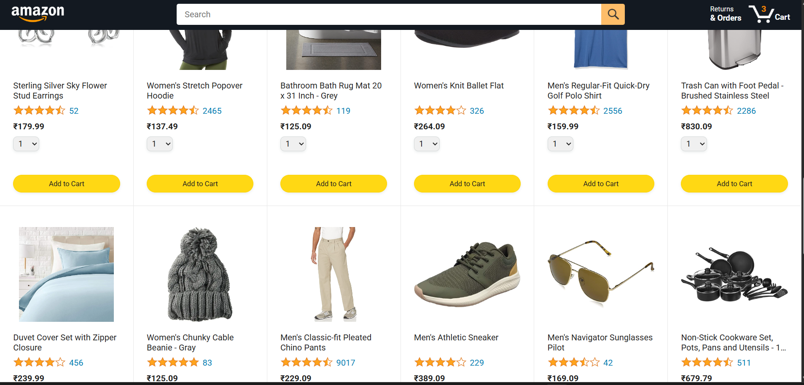
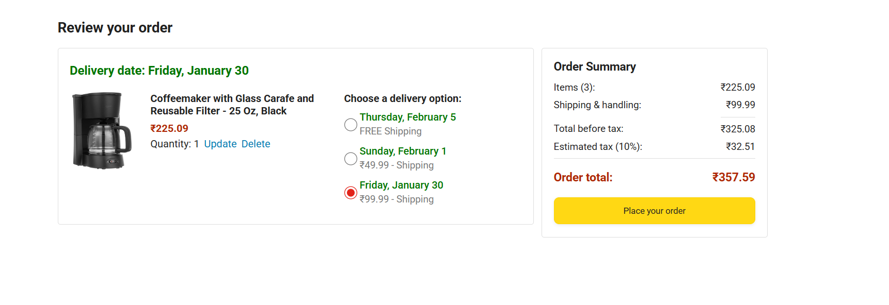
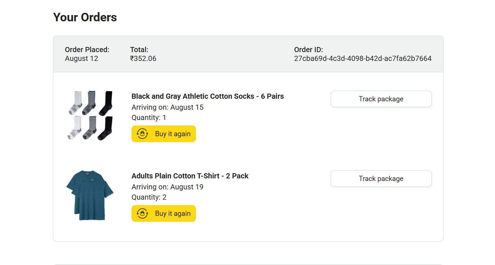

# Amazon Clone – Vanilla JavaScript Shopping Cart

A browser-based Amazon-style shopping experience built using **pure JavaScript, HTML, and CSS**, with a strong focus on **core frontend fundamentals** such as data-driven UI rendering, state management, modular code structure, and user interactions — **without using frameworks**.

This project demonstrates how a real-world e-commerce flow works under the hood.


---

## 🚀 Features

- **Dynamic Product Listing**
  - Products rendered from structured JavaScript data
  - Images, ratings, prices, and quantity selectors generated programmatically

- **Cart Functionality**
  - Add products to cart
  - Shared cart state across pages
  - Live cart quantity updates in the header

- **Checkout Flow**
  - Order summary with selected products
  - Quantity display and delete functionality
  - Multiple delivery options per product

- **Delivery Date Calculation**
  - Realistic delivery dates calculated using `dayjs`
  - Shipping prices update dynamically based on selection

- **Payment Summary**
  - Item subtotal
  - Shipping & handling
  - Tax calculation (10%)
  - Final order total

---

## 🧠 Core Concepts Demonstrated

This project intentionally avoids frameworks to demonstrate a strong understanding of:

- DOM manipulation
- Event handling and event listeners
- Modular JavaScript using ES Modules
- Shared application state
- Separation of concerns
- Dynamic HTML generation using template literals
- Data-driven UI updates
- Real-world e-commerce logic (cart, shipping, tax)

---
## 📁 Project Structure

```text
.
├── backend/
│   └── products.json
│
├── data/
│   ├── cart.js
│   ├── deliveryOptions.js
│   └── products.js
│
├── images/
│   ├── icons/
│   ├── products/
│   ├── ratings/
│   ├── amazon-logo.png
│   ├── amazon-logo-white.png
│   ├── amazon-mobile-logo.png
│   ├── amazon-mobile-logo-white.png
│   ├── appliance-instructions.png
│   ├── appliance-warranty.png
│   └── clothing-size-chart.png
│
├── jasmine-test/
│
├── scripts/
│   ├── checkout/
│   │   ├── orderSummary.js
│   │   └── paymentSummary.js
│   ├── utils/
│   │   └── money.js
│   ├── amazon.js
│   └── checkout.js
│
├── styles/
│   ├── shared/
│   └── pages/
│
├── index.html
├── checkout.html
├── orders.html
├── tracking.html
└── README.md


---

## 🔄 Application Flow

1. Products are loaded from `products.js`
2. UI is rendered dynamically using JavaScript
3. Users add items to the cart
4. Cart data is managed centrally via `cart.js`
5. Checkout page:
   - Calculates delivery dates
   - Updates shipping cost per item
   - Recalculates totals instantly
6. Payment summary updates automatically after every change

---

## 🛠 Technologies Used

- HTML5
- CSS3 (Responsive Design)
- Vanilla JavaScript (ES6+)
- `dayjs` for date calculations

---
## 📈 Future Improvements {mainly adding backend }

- Persist cart using `localStorage`
- Add quantity update functionality
- Improve accessibility (ARIA support)
- Add unit tests
- Rebuild using React or Next.js for comparison

---

## 👤 Author

**Sparsh**  
Frontend Developer (Fundamentals-first approach)
